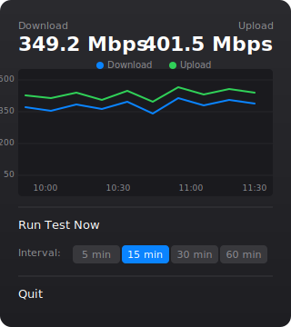

# Internet Speed

A native macOS menu bar app that periodically runs internet speed tests and displays your download/upload speeds with a history chart.


<p align="center">
  
</p>

## Features

- Native SwiftUI menu bar app with a popover dashboard
- Download/upload speed chart over time (Swift Charts)
- Configurable test interval (5, 15, 30, or 60 minutes)
- Run a speed test manually at any time
- Persists speed history across restarts
- Starts automatically on login via LaunchAgent
- Uses [Ookla's official Speedtest CLI](https://www.speedtest.net/apps/cli) for accurate results

## Requirements

- macOS 14+
- Swift 5.9+ (included with Xcode Command Line Tools)
- [Homebrew](https://brew.sh) (used to install the Speedtest CLI)

## Install

```bash
git clone https://github.com/samjkwong/internet-speed.git
cd internet-speed
./install.sh
```

This will:
1. Install the [Ookla Speedtest CLI](https://www.speedtest.net/apps/cli) via Homebrew (if not already installed)
2. Build the app from source
3. Install the binary to `~/.local/bin`
4. Register a LaunchAgent so the app starts on login
5. Start the app immediately

## Uninstall

```bash
./uninstall.sh
```

## Usage

Click the speed indicator in your menu bar to open the dashboard:

- **Current speeds** shown at the top
- **Chart** displays download/upload history over time
- **Run Test Now** triggers an immediate speed test
- **Interval picker** lets you change how often tests run (default: 15 min)

## Development

Build and run locally:

```bash
swift build
.build/debug/InternetSpeed
```

## How It Works

The app uses SwiftUI's `MenuBarExtra` with a `.window` style for the popover UI, Swift Charts for the speed history graph, and Ookla's official Speedtest CLI to measure internet speed. Speed tests run on a background thread so the UI stays responsive. Results are persisted to `~/Library/Application Support/InternetSpeed/history.json`. A macOS LaunchAgent keeps the app running across logins.
